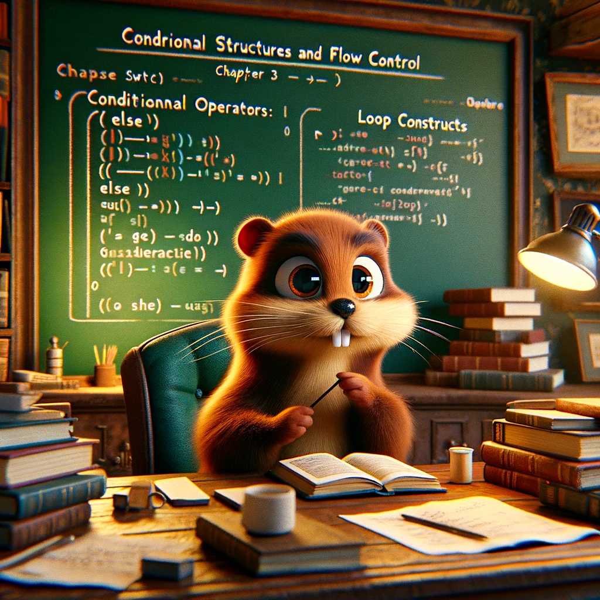

# Опановування основами Go: Практичний посібник з освоєння мови Go

## Глава 3: Контрольні структури та управління потоком

### 3.1 Умовні оператори: If, Else та Switch

В кожній мові програмування, умовні оператори дуже важливі, тому що вони дозволяють вам контролювати потік
вашого коду. В Go, у вас є "if", "else" та "switch" для того, щоб приймати рішення на основі умов. Давайте їх
розглянемо!

#### 3.1.1 Оператор "if"

Оператор "if" - це ваш основний інструмент для тестування стану.
Якщо стан є істинним, код всередині фігурних дужок виконується.
Ось простий приклад:

```
x := 42

if x > 10 {
    fmt.Println("x is greater than 10")
}
```

У цьому прикладі, оскільки `x` дорівнює `42` і це більше, ніж `10`, буде виведено повідомлення "x більше ніж 10".

#### 3.1.2 Конструкція If-Else

А що якщо ви хочете виконати деякий код, коли умова невірна?
Тут на допомогу приходить "else"!

Перегляньте цей приклад:

```
x := 5

if x > 10 {
    fmt.Println("x is greater than 10")
} else {
    fmt.Println("x is not greater than 10")
}
```

Оскільки `x` дорівнює `5` і він не більший за `10`, буде надруковано повідомлення "x не більше за 10".

#### 3.1.3 Інструкція If-Else If

Інколи у вас може бути більше, ніж два можливих шляхи для вашого коду.
Ви можете послідовно з'єднати кілька умов, використовуючи "else if".
Ось приклад:

```
x := 10

if x > 20 {
    fmt.Println("x is greater than 20")
} else if x > 10 {
    fmt.Println("x is greater than 10")
} else {
    fmt.Println("x is not greater than 10 or 20")
}
```

У цьому прикладі, повідомлення "x не більше за 10 або 20" буде виведено, оскільки `x` дорівнює `10`,
і жодна з умов не є вірною.

#### 3.1.4 Конструкція "switch"

Коли вам потрібно перевірити кілька умов, "switch" - це чистіший спосіб обробки цього.
Замість написання купи операторів "if-else", ви можете використовувати "switch" наступним чином:

```
x := 3

switch x {
case 1:
    fmt.Println("x is 1")
case 2:
    fmt.Println("x is 2")
case 3:
    fmt.Println("x is 3")
default:
    fmt.Println("x is something else")
}
```

У цьому прикладі, буде виведено повідомлення "x є 3", тому що значення `x` дорівнює 3.

> 🚀 Порада : Коли ви порівнюєте прості значення (наприклад, цілі числа або рядки),
> "switch" простіше читати, ніж купа "if-else" виразів.

Конструкція switch ... case також може бути використана для більш складних умов керування потоком виконання коду
наступним чином:

```go
package main

import "fmt"

func main() {
	x := 3

	switch {
	case x > 5:
		fmt.Println("x більше 5")
	case x < 5 && x > 0:
		fmt.Println("x менше 5 та більше 0")
	default:
		fmt.Println("x менше або дорівнює 0")
	}
}
```

У цьому прикладі, ключове слово switch використовується без змінної. Вмісто цього, ми використовуємо кілька case, які
містять математичні вирази, щоб перевірити значення змінної x. Кожен case виконується один за одним до тих пір, доки
умова не повертає true. Якщо жодна умова не виконується, тоді виконується тіло default.

Ключове слово `switch` в Go може також використовуватись з визначенням типу даних таким чином:
```go
package main

import "fmt"

func main() {
	var i any = "hello"

	switch v := i.(type) {
	case int:
		fmt.Printf("Двічі %v є %v\n", v, v*2)
	case string:
		fmt.Printf("%q має довжину %v\n", v, len(v))
	default:
		fmt.Printf("Невідомий тип %T!\n", v)
	}
}
```

Тепер ви знаєте основи умовних операторів в Go!
Вони є важливими для управління потоком вашого коду і роблять ваші програми розумнішими.

### 3.2 Конструкції циклу: For та Range

Якщо вам потрібно кілька разів запустити певний код або ітеруватися по колекції елементів,
вам на допомогу приходять цикли!
У Go у вас є потужний цикл "for" та надзвичайно зручне ключове слово "range"
для проходу по різних типах даних. Дізнаємося про це більше!

#### 3.2.1 Цикл For

Цикл "for" є єдиним конструктивом циклу в Go, але він достатньо гнучкий, щоб впоратися з різними сценаріями циклу.
Подивіться на ці приклади:

**Основний цикл for:**

```
for i := 0; i < 5; i++ {
    fmt.Println("Value of i:", i)
}
```
Цей цикл виведе значення i від 0 до 4.

**Цикл у стилі While**:

```
i := 0
for i < 5 {
   fmt.Println("Value of i:", i)
   i++
}
```
Цей цикл робить те саме, що й базовий цикл for вище, але виглядає більш подібно на цикл "while" з інших мов.

**Безкінечний цикл:**

```
for {
// Your code here
}
```

Цей цикл буде виконуватися вічно, тому будьте обережні! 
Вам знадобиться оператор "break" або умова для виходу з циклу.

#### 3.2.2 Range (Діапазон)

Коли ви хочете пройтися циклом по елементах в зрізі, масиві або мапі, ключове слово "range" робить це дуже простим. Воно повертає індекс та значення елементів по черзі. Подивимося на декілька прикладів:

**Циклічний прохід крізь зріз:**

```
numbers := []int{10, 20, 30, 40, 50}

for i, num := range numbers {
   fmt.Printf("Index: %d, Value: %d\n", i, num)
}
```
Цей цикл виведе індекс та значення кожного елемента в сегменті.

**Проходження через мапу:**

```
fruits := map[string]string{
   "a": "apple",
   "b": "banana",
   "c": "cherry",
}

for key, value := range fruits {
   fmt.Printf("Key: %s, Value: %s\n", key, value)
}
```
Цей цикл виведе ключ та значення кожного елемента `map`.

> 🚀 Порада : Якщо вам не потрібен індекс (або ключ) від "range", ви можете використовувати порожній ідентифікатор `_` 
> щоб його ігнорувати:

```
for _, num := range numbers {
  fmt.Println("Value:", num)
}
```
```
// loop without value
	for i := range "Hello World" {
		// This block of code will be executed once for each character in the string.
		fmt.Printf("Index: %d\n", i)
	}
```
Тепер у вас є ґрунтовне розуміння циклів в Go!

За допомогою універсального циклу "for" та зручного ключового слова "range",
ви можете ітерувати через різні типи даних.
