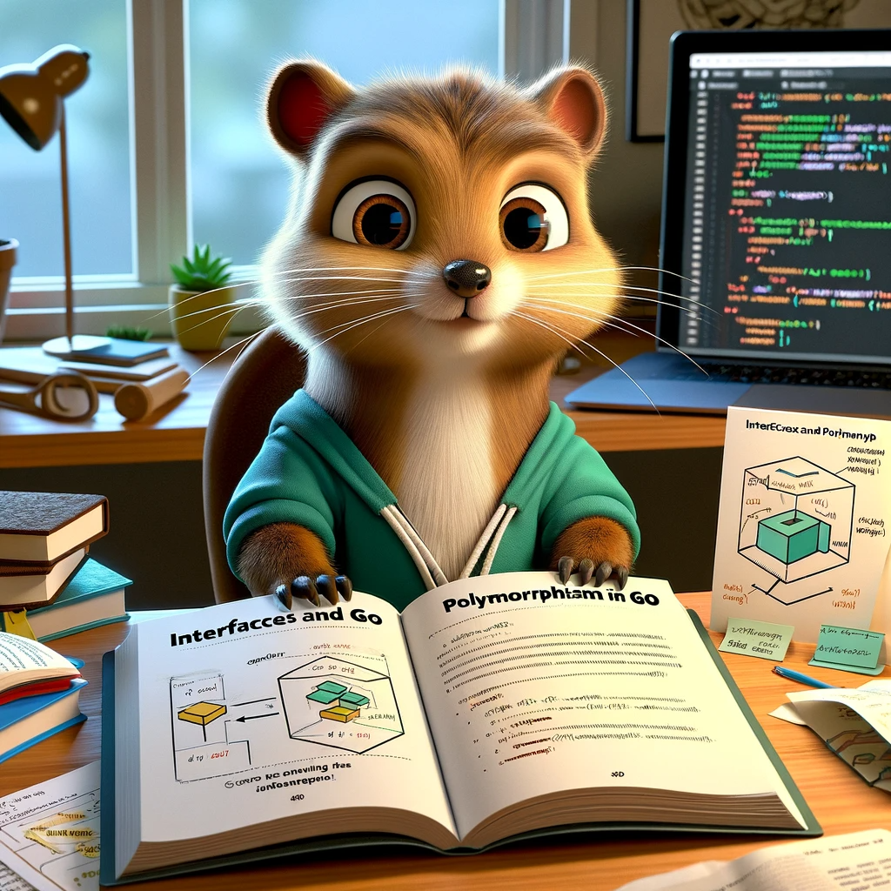
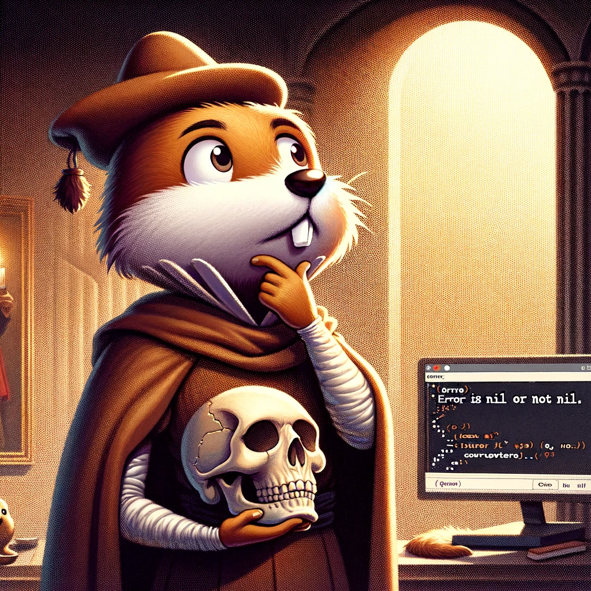

# Опановування основами Go: Практичний посібник з освоєння мови Go

## Розділ 6: Інтерфейси та поліморфізм

### 6.1. Розуміння інтерфейсів

В Go, інтерфейси є фундаментальним концептом, який дозволяє реалізувати поліморфізм та гнучкість у дизайні програм.
Інтерфейс в Go визначається як набір методів, але він не реалізує ці методи - він тільки вказує, що інші типи повинні
реалізувати.

#### Основи Інтерфейсів

Інтерфейс у Go визначається таким чином:

```go
package simpleform

type Shape interface {
	Area() float64
	Perimeter() float64
}
```

У цьому прикладі, Shape - це інтерфейс, що вимагає від будь-якого типу, який вирішить його імплементувати, мати методи
Area() та Perimeter(), обидва з яких повинні повертати float64.

#### Імплементація Інтерфейсів

### 6.2 Імплементація Інтерфейсів

Імплементація інтерфейсів у Go є важливим аспектом створення гнучкого та легко розширюваного коду. Це дозволяє різним
типам взаємодіяти з уніфікованим інтерфейсом, що спрощує розробку і підтримку програм.

В Go, тип імплементує інтерфейс, якщо він реалізує всі методи інтерфейсу. Немає явного ключового слова "implements", як
у деяких інших мовах; це відбувається автоматично.

#### Автоматична Імплементація

Як ми вже згадували, у Go імплементація інтерфейсу відбувається неявно. Тип імплементує інтерфейс, якщо він реалізує
**всі його методи**.

Нема потреби в явно вказувати, що певний тип імплементує певний інтерфейс.

```go
package myform

type Rectangle struct {
	Width, Height float64
}

func (r Rectangle) Area() float64 {
	return r.Width * r.Height
}

func (r Rectangle) Perimeter() float64 {
	return 2 * (r.Width + r.Height)
}

// Rectangle тепер імплементує інтерфейс Shape
```

#### Приклад Імплементації Інтерфейсу

Розглянемо інтерфейс Formatter:

```go
package models

type Formatter interface {
	Format() string
}
```

Щоб імплементувати цей інтерфейс, тип має визначити метод Format(), який повертає string. Наприклад:

```go
package models

import "fmt"

type User struct {
	Name, Role string
}

// User імплементує інтерфейс Formatter
func (u User) Format() string {
	return fmt.Sprintf("%s (%s)", u.Name, u.Role)
}
```

Тепер будь-який екземпляр User може бути використаний там, де очікується Formatter.

#### Використання Інтерфейсів

Інтерфейси використовуються для створення коду, який може працювати з об'єктами різних типів, але які мають спільні
методи. Це дозволяє писати функції та пакети, які не залежать від конкретних реалізацій типів.

```go
package simpleform

import "fmt"

type Shape interface {
	Area() float64
	Perimeter() float64
}

type Rectangle struct {
	Width, Height float64
}

func (r Rectangle) Area() float64 {
	return r.Width * r.Height
}

func (r Rectangle) Perimeter() float64 {
	return 2 * (r.Width + r.Height)
}

func printArea(shapes ...Shape) {
	for _, shape := range shapes {
		fmt.Println(shape.Area())
	}
}

// Можна викликати printArea з будь-якими типами, які імплементують Shape
// printArea(Rectangle{Width: 3, Height: 4})
```

Функції та методи можуть приймати параметри типу інтерфейсу, що дозволяє їм працювати з будь-яким типом, який
імплементує цей інтерфейс.
Ще приклад:

```go
package main

import "fmt"

type Formatter interface {
	Format() string
}

type User struct {
	Name, Role string
}

// User імплементує інтерфейс Formatter
func (u User) Format() string {
	return fmt.Sprintf("%s (%s)", u.Name, u.Role)
}

func PrintFormatted(f Formatter) {
	fmt.Println(f.Format())
}

func main() {
	// Можна передати User, оскільки він імплементує Formatter
	PrintFormatted(User{Name: "Аліса", Role: "Адміністратор"})
}
```

#### Переваги Інтерфейсів

Інтерфейси в Go забезпечують високий рівень абстракції та гнучкості у дизайні програм. Вони дозволяють реалізувати
поліморфічну поведінку, спрощують тестування (завдяки змозі використовувати моки), та підвищують модульність та
відокремленість коду.

Використання інтерфейсів:

- дозволяє створювати системи, які легко розширювати та модифікувати, не втрачаючи при цьому
  стабільності та надійності.
- є ключем до ефективного застосування принципів `SOLID` в Go, зокрема принципу
  відкритості/закритості та принципу підстановки Лісков.

#### 6.2.1 Стандартні Інтерфейси в Go

Go має кілька стандартних інтерфейсів, які використовуються у стандартній бібліотеці та широко прийняті у спільноті Go.
Освоєння цих інтерфейсів може значно підвищити гнучкість та перевикористання вашого коду. До найбільш важливих
стандартних інтерфейсів належать:

1. `Stringer`

   Один з найбільш використовуваних інтерфейсів у Go - це fmt.Stringer. Цей інтерфейс використовується для конвертації
   об'єктів у рядки і має всього один метод:
   ```go
   type Stringer interface {
        String() string
    }

   ```
   Якщо тип імплементує Stringer, то його метод String() викликається автоматично, коли використовується з такими
   функціями, як fmt.Println.
2. `io.Reader` та `io.Writer`

   Інтерфейси `io.Reader` і `io.Writer` відіграють ключову роль у введенні-виведенні даних:
   ```go
   type Reader interface {
   // Read заповнює p зчитаними даними та повертає кількість зчитаних байтів
        Read(p []byte) (n int, err error) 
   }
   type Writer interface {
   // Write записує p у вихідний потік та повертає кількість записаних байтів
       Write(p []byte) (n int, err error) 
   }

   ```

3. `error`

   Інтерфейс error є стандартним способом представлення помилок у Go:
   ```go
    type error interface {
      Error() string
    }
    ```
   Створення власних типів помилок, які імплементують цей інтерфейс, дозволяє передавати додаткову інформацію про
   помилку.

#### Перевірка Інтерфейсів на `nil` та Поширені Помилки

Перевірка інтерфейсів на nil в Go має деякі нюанси, які важливо розуміти, особливо коли мова йде про роботу з власними
помилками.

Інтерфейс у Go є nil тільки тоді, коли і його тип, і значення nil. Це означає, що інтерфейс, який містить nil значення
певного типу, не буде вважатися nil інтерфейсом.

#### Поширена Помилка при Поверненні Власного Error

|                                                                                                                                               |                                                  |
|-----------------------------------------------------------------------------------------------------------------------------------------------|--------------------------------------------------|
| Поширеною помилкою є повернення власного типу помилки, який може мати nil значення, але не розглядається як nil у контексті інтерфейсу error. |  |

```go
package main

import "fmt"

type MyCoolError string

func (e *MyCoolError) Error() string {
	return string(*e)
}

func newErr(in string) *MyCoolError {
	if in != "" {
		out := MyCoolError(in)
		return &out
	}
	return nil
}
func newCorrectErr(in string) error {
	if in != "" {
		out := MyCoolError(in)
		return &out
	}
	return nil
}

func checkErr(err error) error {
	return err
}

func wrappedError(err error) error {
	if checkErr(err) != nil {
		return fmt.Errorf("something went wrong : %w", err)
	}
	return nil
}

func main() {
	const okError = "ok, some error"
	var err error
	if err = checkErr(newErr(okError)); err != nil {
		// Prints "Not empty : error is [ok, some error]"
		fmt.Printf("Not empty : error is [%v]\n", err)
	}
	if err = checkErr(newErr("")); err != nil {
		// Prints: Hello Rob Pike: error is [<nil>] (*main.MyCoolError)
		fmt.Printf("Hello Rob Pike: error is [%v] (%T)\n", err, err)
	}
	if err = wrappedError(newErr("")); err != nil {
		// Prints: Hello Rob Pike: wrapped error is [something went wrong : <nil>] (*fmt.wrapError)
		fmt.Printf("Hello Rob Pike: wrapped error is [%v] (%T)\n", err, err)
	}
	// Correct way
	if err = checkErr(newCorrectErr("")); err != nil {
		// Do not enter here
		fmt.Printf("Hello Rob Pike: error is [%v] (%T)\n", err, err)
	}
	if err = wrappedError(newCorrectErr("")); err != nil {
		// Do not enter here
		fmt.Printf("Hello Rob Pike: wrapped error is [%v] (%T)\n", err, err)
	}
	if err = wrappedError(newCorrectErr(okError)); err != nil {
		// Correct way: wrapped error is [something went wrong : ok, some error] (*fmt.wrapError)
		fmt.Printf("Correct way: wrapped error is [%v] (%T)\n", err, err)
	}
}

```

#### Рекомендації

**Щоб уникнути таких помилок, важливо:**

- Чітко розуміти різницю між nil значенням та nil інтерфейсом.
- Бути обережними при роботі з інтерфейсами та власними типами помилок.
- Перевіряти на nil не тільки інтерфейс, але й конкретне значення всередині інтерфейсу, якщо є така потреба.
- Уникати повернення вказівника на власний тип помилки, повертаючі явним чином nil як error

Розуміння цих нюансів є ключовим для написання надійного та безпечного коду в Go.

### 6.3 Вбудова та Поліморфізм

У Go, вбудова дозволяє одним структурам включати інші, створюючи складні типи, які можуть використовувати поліморфізм
через інтерфейси. Це дозволяє створювати гнучкі і легко розширювані архітектури.

#### Вбудова Структур

Вбудова структур в Go дозволяє одній структурі "наслідувати" поля або методи іншої структури. Це робиться шляхом
вказівки типу без імені поля всередині структури:

```go
package mperson

type Person struct {
	Name string
	Age  int
}

type Employee struct {
	Person
	Position string
}
```

У цьому прикладі, `Employee` має всі поля та методи `Person`, крім того, він додає своє власне поле `Position`.

#### Поліморфізм через Інтерфейси

Поліморфізм у Go досягається через інтерфейси. Це дозволяє писати функції, які можуть працювати з різними типами, поки
ті типи імплементують потрібні інтерфейси.

```go
package mperson

import "fmt"

type Person struct {
	Name string
	Age  int
}

type Talker interface {
	Talk() string
}

func (p Person) Talk() string {
	return "My name is " + p.Name
}

func ChatWith(t Talker) {
	fmt.Println(t.Talk())
}
```

Тут будь-який тип, який має метод `Talk()`, імплементує інтерфейс `Talker`, і може бути переданий у функцію `ChatWith`.

#### Вбудова Інтерфейсів

Інтерфейси також можуть бути вбудовані в інші інтерфейси, створюючи складніші інтерфейси:

```go
package mperson

type Talker interface {
	Talk() string
}

type Walker interface {
	Walk() string
}

type WalkerTalker interface {
	Walker
	Talker
}
```

Тут `WalkerTalker` є інтерфейсом, який імплементується будь-яким типом, який має обидва методи: `Walk()` та `Talk()`.

#### Використання Вбудови для Поліморфізму

Використання вбудови структур та інтерфейсів у Go дозволяє створити потужні та гнучкі дизайни без строгого наслідування,
яке є типовим для багатьох інших об'єктно-орієнтованих мов. Це забезпечує більшу модульність коду і дозволяє легко
розширювати та змінювати поведінку програми без зміни існуючих компонентів.

#### Приклад Використання Вбудови та Поліморфізму

Створім приклад програми на Go, де ми використаємо вбудову та поліморфізм для розробки невеликої системи управління
працівниками. У цій системі будуть різні типи працівників, кожен з яких має свою унікальну поведінку, але також спільні
риси.

### Крок 1: Визначення Базових Типів

Спочатку визначимо базовий тип `Person` та інтерфейс `Worker`:

```go
package main

import (
	"fmt"
	"strconv"
)

// Базовий тип Person
type Person struct {
	Name string
	Age  int
}

// Функція, що повертає опис особи
func (p Person) String() string {
	return p.Name + ", вік: " + strconv.Itoa(p.Age)
}

// Інтерфейс Worker з методом Work()
type Worker interface {
	Work() string
}
```

### Крок 2: Визначення Конкретних Типів Працівників

Далі, створимо кілька структур для різних типів працівників, кожна з яких вбудовує `Person` та імплементує `Worker`:

```go
package main

import (
	"fmt"
	"strconv"
)

// Базовий тип Person
type Person struct {
	Name string
	Age  int
}

// Функція, що повертає опис особи
func (p Person) String() string {
	return p.Name + ", вік: " + strconv.Itoa(p.Age)
}

// Інтерфейс Worker з методом Work()
type Worker interface {
	Work() string
}

// Менеджер
type Manager struct {
	Person
	Department string
}

func (m Manager) Work() string {
	return m.Name + " керує відділом " + m.Department
}

// Розробник
type Developer struct {
	Person
	Language string
}

func (d Developer) Work() string {
	return d.Name + " пише код на " + d.Language
}
```

### Крок 3: Використання Поліморфізму

Тепер, коли у нас є наші структури, ми можемо написати функцію, яка приймає `Worker` і виконує їхній метод `Work`:

```go
package main

import (
	"fmt"
	"strconv"
)

// Базовий тип Person
type Person struct {
	Name string
	Age  int
}

// Функція, що повертає опис особи
func (p Person) String() string {
	return p.Name + ", вік: " + strconv.Itoa(p.Age)
}

// Інтерфейс Worker з методом Work()
type Worker interface {
	Work() string
}

// Менеджер
type Manager struct {
	Person
	Department string
}

func (m Manager) Work() string {
	return m.Name + " керує відділом " + m.Department
}

// Розробник
type Developer struct {
	Person
	Language string
}

func (d Developer) Work() string {
	return d.Name + " пише код на " + d.Language
}

func report(w Worker) {
	fmt.Println(w.Work())
}
```

### Крок 4: Головна Функція

Нарешті, використовуємо наші типи у головній функції:

```go
package main

/* skipped */

func main() {
	manager := Manager{
		Person:     Person{"Аліса", 35},
		Department: "Розвиток",
	}

	developer := Developer{
		Person:   Person{"Боб", 30},
		Language: "Go",
	}

	report(manager)
	report(developer)
}

```

У цій програмі ми створили базовий тип `Person` і інтерфейс `Worker`. Ми потім визначили два типи працівників: `Manager`
і `Developer`, кожен з яких вбудовує `Person` і імплементує `Worker`. Головна функція `main` створює екземпляри цих
типів і використовує функцію `report`, щоб продемонструвати поліморфізм.

### 6.4 Type Assertions та Type Switches

#### Type Assertions

Type assertion у Go - це операція, яка використовується для перевірки та перетворення типу значення інтерфейсу на більш
конкретний тип. Це корисно, коли ви знаєте, що реальний тип значення всередині інтерфейсу може бути іншим.

##### Синтаксис Type Assertion

```
value, ok := x.(T)
```

- `x` - змінна типу інтерфейс.
- `T` - тип, на який ви хочете перетворити `x`.
- `value` - змінна нового типу `T`.
- `ok` - булева змінна, яка буде `true`, якщо перетворення успішне.

#### Приклад

```go
package main

import "fmt"

func main() {
	var i interface{} = "Hello"

	s, ok := i.(string)
	fmt.Println(s, ok) // Виведе: Hello true

	f, ok := i.(float64)
	fmt.Println(f, ok) // Виведе: 0 false
}
```

### Type Switches

Type switch - це конструкція, яка дозволяє перевірити кілька типів всередині одного switch виразу. Це корисно для
визначення типу інтерфейсу, коли ви не знаєте заздалегідь, який саме тип він може мати.

#### Синтаксис Type Switch

```go
switch v := x.(type) {
case T1:
// v має тип T1
case T2:
// v має тип T2
...
default:
// жоден з типів не співпав, v має той же тип, що й x
}
```

#### Приклад

```go
package main

import "fmt"

func main() {

	var i interface{} = 7

	switch v := i.(type) {
	case int:
		fmt.Println("Ціле число:", v)
	case string:
		fmt.Println("Рядок:", v)
	default:
		fmt.Println("Інший тип")
	}
}
```

У цьому прикладі, `i` є інтерфейсом, який фактично містить `int`. Type switch визначає це і виконує відповідний блок
коду.

### Використання Type Assertions та Type Switches

Type assertions та type switches є потужними інструментами в Go для роботи з абстрактними типами інтерфейсів. Вони
дозволяють розробникам безпечно перевіряти та маніпулювати типами в рантаймі, що робить код більш гнучким і робить
можливим поліморфічну поведінку.
